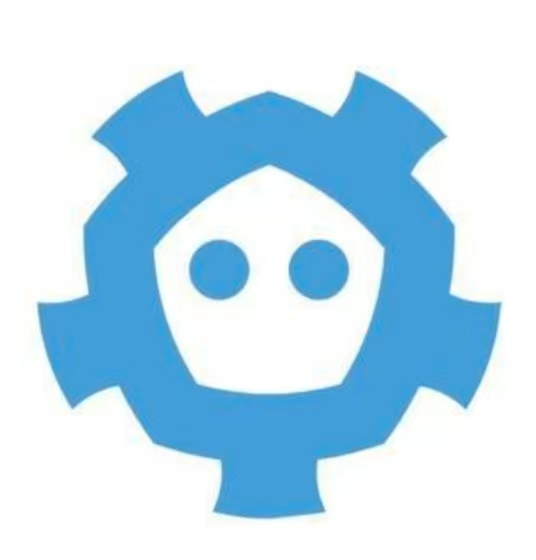
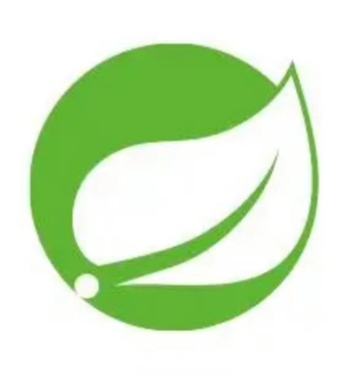
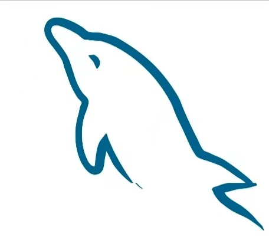

### I Like Coding⚡

My name is Barry Yan or Hai Feng Geek. 

- Mail：1712229564@qq.com
- Blog：[ibarryyan.blog.csdn.net](https://ibarryyan.blog.csdn.net)
- WeChat：[扯编程的淡](https://img-blog.csdnimg.cn/b7617684e5484a31a4d934e61fd27776.png)

#### Programming Techniques

<code></code>
<code></code>
<code></code>
<code></code>
<code></code>
<code></code>
<code></code>
<code></code>
<code></code>
<code></code>
<code>etc.</code>

#### Open Source Repository

- :oncoming_taxi: [Front-Back design](https://github.com/ibarryyan/front-back-design)
- :oncoming_bus: [Go Server Demo](https://github.com/ibarryyan/go-server)
- :oncoming_police_car: [Beego-requestid](https://github.com/ibarryyan/beego-requestid)
- :bus: [Go Design Patterns](https://github.com/ibarryyan/go-design-patterns)
- :taxi: [gRPC Learn Demo](https://github.com/ibarryyan/grpc-learn-demo)
- :monorail: [Go Tips](https://github.com/ibarryyan/golang-tips-100)
- :railway_car: [QR-code](https://github.com/ibarryyan/QR-code)

Welcome to click on star !